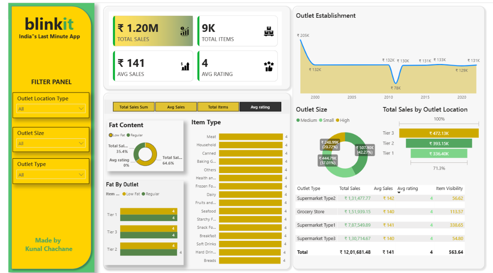

# 📊 Blinkit Sales Analysis Dashboard

<p align="center">
  
</p>

<p align="center">
  
  
  
  
</p>

---

## 🎯 Project Overview

This project presents an interactive **Power BI Dashboard** built to analyze Blinkit's retail sales performance, customer purchasing behavior, outlet efficiency, and product trends.

The dashboard transforms raw transactional data into actionable insights, helping stakeholders monitor KPIs, identify revenue drivers, and support strategic business decisions.

---

## 🚀 Business Objectives

* Analyze overall sales performance
* Identify top-performing outlet types
* Evaluate outlet size and location impact
* Understand customer product preferences
* Discover high-revenue product categories
* Support data-driven expansion strategies

---

## 📈 Key Performance Indicators

| KPI                 | Value  |
| ------------------- | ------ |
| 💰 Total Sales      | ₹1.20M |
| 📦 Total Items Sold | 9K     |
| 📊 Average Sales    | ₹141   |
| ⭐ Average Rating    | 4.0    |

---

## 📊 Dashboard Insights

### Revenue Analysis

* Generated over **₹1.2 Million** in total sales.
* Sales performance remained stable across most outlet establishment years.

### Outlet Performance

* Tier 3 outlets generated the highest revenue contribution.
* Medium-sized outlets outperformed small and high-sized outlets.
* Supermarket Type 1 emerged as the highest revenue-generating outlet type.

### Product Analysis

* Regular-fat products contributed significantly more revenue than low-fat products.
* Household, Dairy, and Snack Foods were among the best-performing categories.

### Customer Insights

* Average customer rating maintained a strong score of **4.0/5**.
* Product visibility showed a direct relationship with sales performance.

---

## 📷 Dashboard Snapshots

### Executive Dashboard


### Sales KPI Analysis


### Average Sales Analysis


### Item Performance Analysis


### Rating Analysis


---

## 🛠️ Tools & Technologies

| Category      | Technology             |
| ------------- | ---------------------- |
| BI Tool       | Power BI               |
| Data Cleaning | Power Query            |
| Data Modeling | Power BI Data Model    |
| Calculations  | DAX                    |
| Data Source   | Excel                  |
| Visualization | Power BI Charts & KPIs |

---

## 🧮 DAX Measures

### Total Sales

```DAX
Total Sales = SUM(BlinkIT[Sales])
```

### Average Sales

```DAX
Average Sales = AVERAGE(BlinkIT[Sales])
```

### Total Items

```DAX
Total Items = COUNT(BlinkIT[Item Identifier])
```

### Average Rating

```DAX
Average Rating = AVERAGE(BlinkIT[Rating])
```

---

## 💡 Skills Demonstrated

* Data Cleaning & Transformation
* Data Modeling
* DAX Calculations
* KPI Development
* Interactive Dashboard Design
* Business Intelligence Reporting
* Retail Sales Analytics
* Data Visualization
* Insight Generation

---

## 📂 Project Structure

```text
Blinkit Data Analysis/
│
├── Images/
│   ├── Avg Sales.png
│   ├── Items.png
│   ├── Sales.png
│   └── rating (1).png
│
├── BlinkIT Grocery Data.xlsx
├── Blinkit dashboard.pbix
├── Blinkit dashboard.pdf
├── blinkit_sales_dashboard.png
└── README.md
```

---

## 📌 Business Impact

This dashboard enables stakeholders to:

✔ Monitor sales performance efficiently

✔ Identify profitable outlet formats

✔ Understand customer purchasing behavior

✔ Optimize inventory planning

✔ Support business expansion decisions

✔ Improve strategic decision-making through data-driven insights

---

## 👨‍💻 Author

### Kunal Chachane

**Data Analyst | Power BI Developer**

🔗 LinkedIn: https://www.linkedin.com/in/kunal-chachane

🐙 GitHub: https://github.com/Kunal-Chachane

---

⭐ If you found this project helpful, consider starring the repository.
