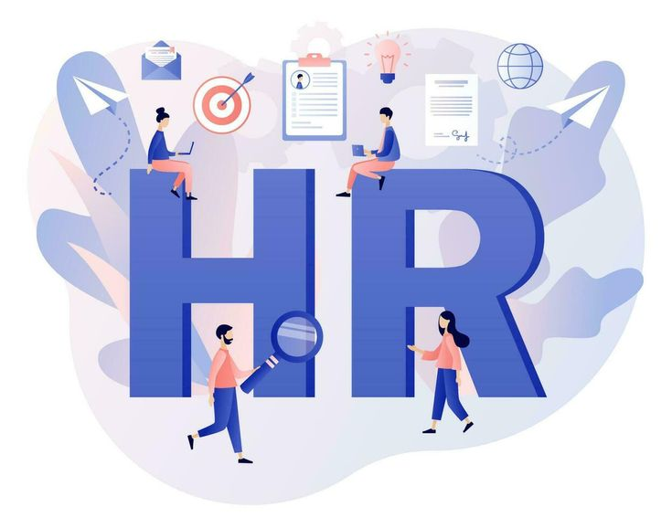

  
  <h1>HR Analytics & Employee Retention Intelligence</h1>
  
<b>Transforming Raw Workforce Data into Strategic Organizational Insights</b>

  ---

  [Overview](#-project-overview) • 
  [Key Metrics](#-core-workforce-metrics) • 
  [Dashboards](#-visual-intelligence-hub) • 
  [Recommendations](#-strategic-recommendations)

 

## 📋 Project Overview
This initiative delivers an end-to-end data analytics solution focused on Human Resources optimization. By leveraging advanced data visualization and statistical modeling, this project identifies critical drivers of employee turnover, evaluates performance efficiency, and provides actionable intelligence to improve organizational health.

---

## 📊 Core Workforce Metrics
*Extracted from a dataset of 500 employee records using Python.*

> ### **25.0% Attrition Rate**
> *Critical focus required for talent retention strategies.*

| Category | Metric | Insight |
| :--- | :--- | :--- |
| **Total Workforce** | 500 Employees | Balanced 52% Female / 48% Male ratio |
| **Performance** | 2.96 / 5.0 | Average rating across all departments |
| **Satisfaction** | 3.06 / 5.0 | Room for improvement in engagement levels |
| **Retention** | 17.7 Years | High average tenure indicates strong core loyalty |
| **Compensation** | $109,394 | Average monthly salary across the organization |
| **Engagement** | 47.4% Overtime | Significant portion of staff working beyond hours |

 

---

## 🖼️ Visual Intelligence Hub

### 1. Executive Overview
A high-level summary of organizational demographics and structural distribution.

 

### 2. Attrition & Retention Deep-Dive
Identifying high-risk segments and the underlying causes of employee turnover.

 

### 3. Performance & Professional Development
Correlation analysis between training investment and employee performance outcomes.

 

### 4. Strategic Insights & Correlations
Data-driven breakdown of employee satisfaction and departmental efficiency.

---

## 🛠️ Tech Stack & Methodology
*   **Data Visualization:** Power BI (Interactive Dashboards)
*   **Data Processing:** Excel (ETL & Cleaning)
*   **Statistical Analysis:** Python (Pandas & Openpyxl for metric extraction)
*   **Design:** Custom background layouts for enhanced UI/UX

---

## 🚀 Strategic Recommendations

1.  **Retention Intervention:** Prioritize the **Operations** department (largest segment) for stay-interviews to mitigate the 25% attrition risk.
2.  **Burnout Prevention:** Address the **47.4% overtime rate** through resource reallocation or hiring to maintain long-term productivity.
3.  **Engagement Optimization:** Implement feedback loops to elevate the **3.06 satisfaction score**, targeting the correlation between work-life balance and performance.
4.  **ROI on Training:** Leverage the **32.5 average training hours** to create high-performer mentorship programs.

 

---

  Project developed for HR Strategic Planning. Data handled with strict confidentiality.

