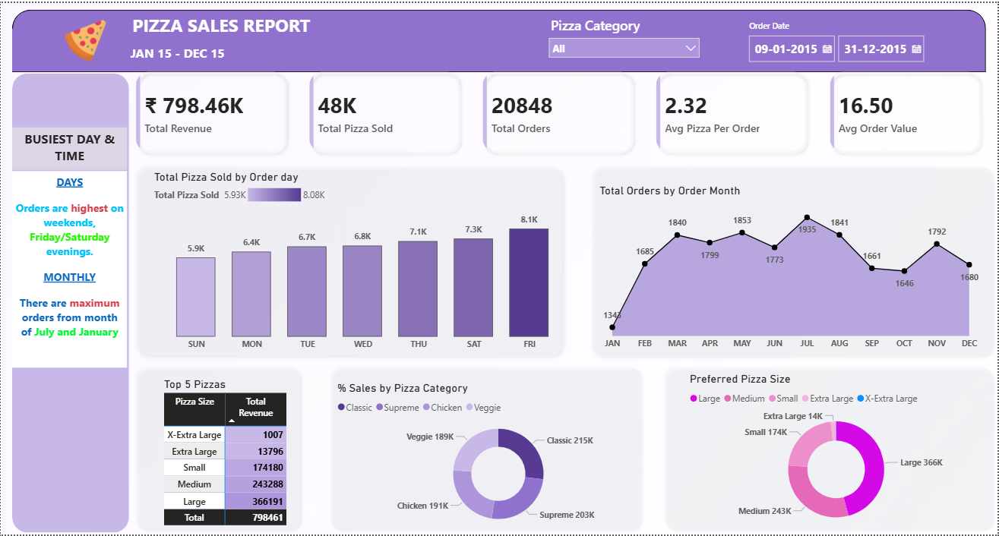
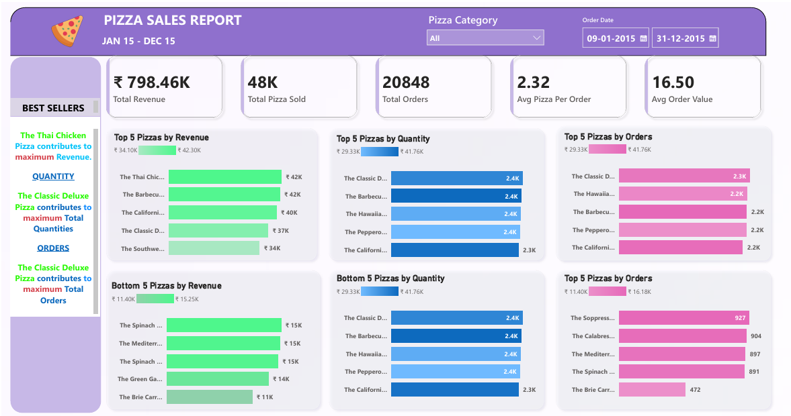
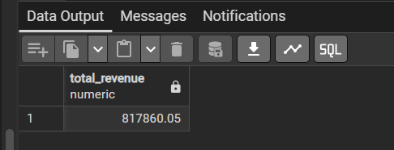
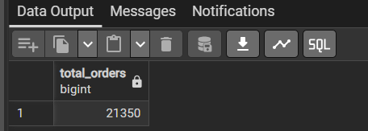
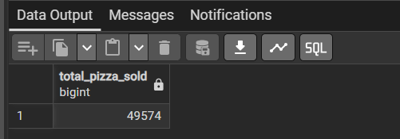

# 🍕 Pizza Sales Analysis & Power BI Dashboard


## 📊 Dashboard Preview

### Page 1: Home Dashboard


### Page 2: Best & Worst Sellers


---

## 📝 Project Overview
This project involves a comprehensive analysis of a pizza store's sales data to derive actionable insights into business performance. Using SQL for data extraction and Power BI for visualization, the project identifies key sales trends, customer preferences, and inventory requirements.

## 💼 Business Problem
The goal is to analyze the pizza sales data to answer critical business questions:
1. What are the key performance indicators (KPIs) for the business?
2. How do sales fluctuate across different days and months?
3. Which pizza categories and sizes contribute most to the revenue?
4. Which are the best and worst-selling pizzas in terms of revenue, quantity, and total orders?

## 🚀 Key Performance Indicators (KPIs)

| KPI | Value | Description |
| :--- | :--- | :--- |
| **Total Revenue** | ₹817,860.05 | Total revenue generated from all pizza orders. |
| **Total Orders** | 21,350 | Total number of distinct orders placed. |
| **Total Pizzas Sold** | 49,574 | Cumulative sum of all pizzas sold across all orders. |
| **Avg Order Value** | ₹38.31 | Average amount spent per order. |
| **Avg Pizzas Per Order** | 2.32 | Average number of pizzas sold per order. |

### Visual KPI Cards
| Total Revenue | Total Orders | Total Pizzas Sold |
| :---: | :---: | :---: |
|  |  |  |

---

## 🛠️ Data Pipeline
1. **Data Sourcing:** Raw data extracted from `pizza_sales_excel_file.csv`.
2. **Data Cleaning:** Handled missing values and formatted date/time columns using Power Query and SQL.
3. **Data Processing:** Loaded data into PostgreSQL for complex SQL analysis.
4. **Data Modeling:** Built a star schema in Power BI with optimized DAX measures.
5. **Visualization:** Designed an interactive two-page dashboard for business stakeholders.

---

## 🔍 SQL Analysis
The following SQL queries were used to validate the data and extract insights:

```sql
-- 1. Total Revenue
SELECT SUM(total_price) AS Total_Revenue FROM pizza_sales;

-- 2. Average Order Value
SELECT SUM(total_price) / COUNT(DISTINCT order_id) AS Avg_Order_Value FROM pizza_sales;

-- 3. Total Pizzas Sold
SELECT SUM(quantity) AS Total_Pizza_Sold FROM pizza_sales;

-- 4. Daily Trend for Total Orders
SELECT DATENAME(DW, order_date) AS order_day, COUNT(DISTINCT order_id) AS total_orders
FROM pizza_sales
GROUP BY DATENAME(DW, order_day);

-- 5. Monthly Trend for Total Orders
SELECT DATENAME(MONTH, order_date) AS Month_Name, COUNT(DISTINCT order_id) AS Total_Orders
FROM pizza_sales
GROUP BY DATENAME(MONTH, order_date)
ORDER BY Total_Orders DESC;
```

---

## 📈 DAX Measures
Optimized DAX measures for real-time calculation in Power BI:

```dax
Total Revenue = SUM(pizza_sales[total_price])

Total Orders = DISTINCTCOUNT(pizza_sales[order_id])

Total Pizzas Sold = SUM(pizza_sales[quantity])

Avg Order Value = [Total Revenue] / [Total Orders]

Avg Pizzas Per Order = [Total Pizzas Sold] / [Total Orders]
```

---

## 🎨 Dashboard Features
- **Dynamic Filters:** Filter by Date Range, Pizza Category, and Pizza Size.
- **Trend Analysis:** Visual representation of daily and monthly order trends.
- **Sales Breakdown:** Percentage distribution of sales by category and size.
- **Top/Bottom Performers:** Automated charts showing the top 5 and bottom 5 pizzas based on multiple metrics.
- **Interactive Tooltips:** Deep dive into specific data points upon hover.

---

## 💡 Business Insights
- **Busiest Day:** Friday sees the highest order volume, followed by Saturday and Thursday.
- **Monthly Peak:** July and May recorded the highest sales figures for the year.
- **Revenue Leader:** The **Thai Chicken Pizza** is the top contributor to revenue (₹43,434.25).
- **Quantity Leader:** The **Classic Deluxe Pizza** leads in total quantity sold (2,453 pizzas).
- **Underperformer:** The **Brie Carre Pizza** generated the lowest revenue and orders.
- **Category Performance:** **Classic** category pizzas contribute the most to overall sales.
- **Size Preference:** **Large (L)** size pizzas account for nearly 46% of total revenue.

---

## 📢 Recommendations
1. **Weekend Promotions:** Introduce special offers on Sundays and Mondays (the slowest days) to increase footfall.
2. **Inventory Optimization:** Ensure higher stock of ingredients for "Classic" category pizzas, especially during the month of July.
3. **Menu Re-evaluation:** Consider revising or replacing the "Brie Carre Pizza" due to its low market demand.
4. **Combo Deals:** Launch "Large Size" family combos since Large pizzas are the most preferred by customers.
5. **Marketing Focus:** Focus digital marketing campaigns on Friday afternoons to capitalize on the weekend surge.

---

## 🎯 Conclusion: What the Company Needs to Improve

Based on the analysis, the company can enhance its operations and profitability by focusing on the following areas:

1. **Strategic Pricing for Slow Days:** 
   The significant drop in sales on Sundays and Mondays indicates an opportunity for "Happy Hour" pricing or exclusive mid-week loyalty rewards to keep the kitchen active and revenue flowing.

2. **Product Lifecycle Management:** 
   The **Brie Carre Pizza** consistently ranks at the bottom. The company should investigate if this is due to taste, price, or lack of promotion. If it doesn't improve after a targeted campaign, it should be replaced with a trending flavor like a "Spicy Paneer" or "BBQ Brisket" variant.

3. **Upselling & Size Strategy:** 
   Since **Large (L)** pizzas are the primary revenue drivers, the sales team should be trained to upsell Medium orders to Large using a "Value-for-Money" proposition. Additionally, introducing an "Extra Large" size for parties could capture more of the weekend market.

4. **Seasonal Inventory Planning:** 
   With peak sales in **May and July**, the supply chain must be robust during these months. Pre-negotiating with suppliers for bulk discounts on "Classic" category ingredients (flour, tomato sauce, mozzarella) during these months will improve profit margins.

5. **Digital Engagement:** 
   Since Fridays are the peak, the company should send out push notifications and email reminders at **11:00 AM and 4:00 PM on Fridays** to stay top-of-mind when customers are making lunch and dinner decisions.

---

## 💻 Tech Stack
- **Dashboarding:** Power BI Desktop
- **Database:** PostgreSQL / MS SQL Server
- **Data Manipulation:** Power Query, DAX
- **Documentation:** Markdown

## 🧠 Skills Demonstrated
- Data Cleaning & Transformation (ETL)
- Advanced SQL Querying
- Data Modeling & DAX Measures
- UI/UX Design for Dashboards
- Statistical Analysis & Business Storytelling

---

## 📁 Project Structure
```text
├── images/                          # KPI and Chart exports
├── pizza_sales_excel_file.csv        # Raw dataset
├── Pizza_sales_dashboard.pbix        # Power BI source file
├── Pizza_sales_dashboard.pdf         # Static dashboard report
├── pizza_sales_dashboard_page1.png   # Dashboard Screenshot 1
├── pizza_sales_dashboard_page2.png   # Dashboard Screenshot 2
├── Pizza Canvas Background.jpg       # Dashboard design asset
└── README.md                         # Project documentation
```

---

## 👤 Author
**Kunal Chachane**
- **GitHub:** [@Kunal-Chachane](https://github.com/Kunal-Chachane)
- **LinkedIn:** [Kunal Chachane](https://linkedin.com/in/kunalchachane)
- **Portfolio:** [Data Analytics Projects](https://github.com/Kunal-Chachane/Power-BI-Dashboards)
